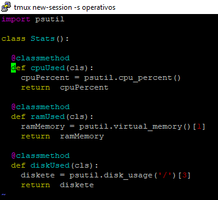
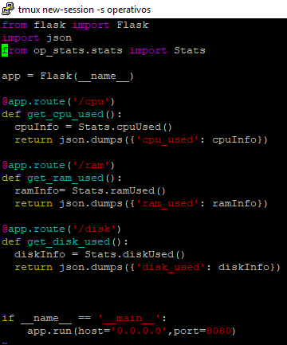
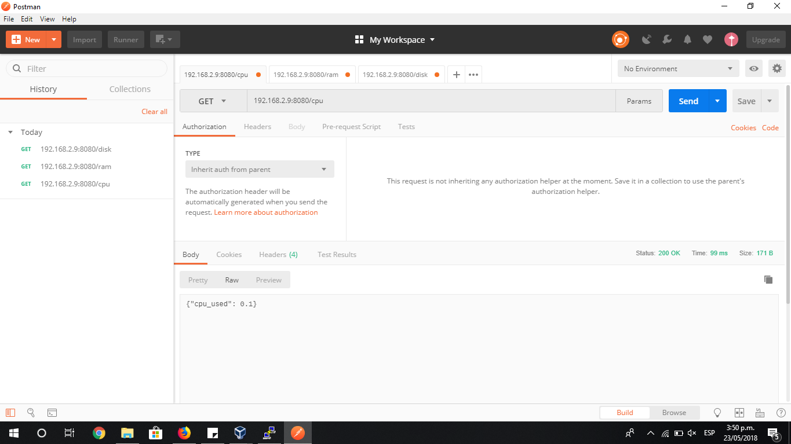
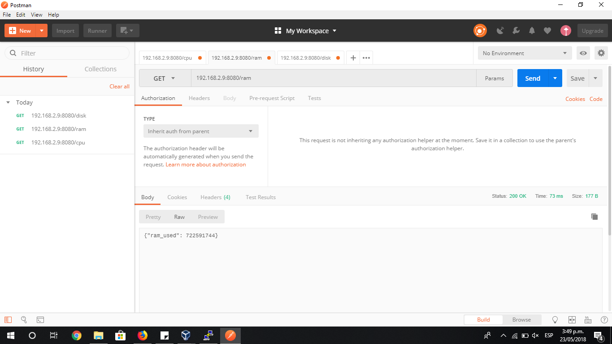
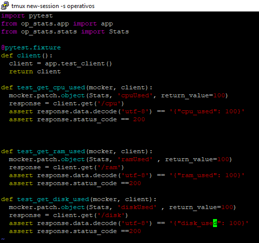
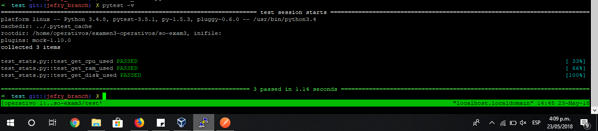
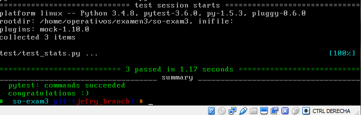
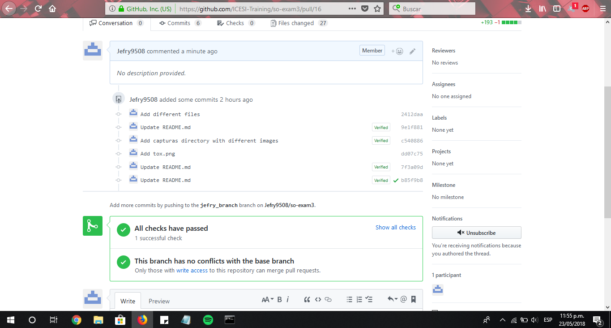

# Sistemas Operacionales - Parcial 3  

**Nombre:** Jefry Cardona Chilito  
**Código:** A00320232  
**Correo:** jefry.cardona@correo.icesi.edu.co  
**Profesor:** Daniel Barragan  
**Url repositorio:** https://github.com/Jefry9508/so-exam3  

## Implemetación de un servicio web en flask

Se aprovisionó el ambiente virtual con las dependencias necesarias para poder dar solución a este parcial, se utilizarón los archivos requirements_dev.txt y requirements.txt que ya se encontraban disponibles en los repositorios del curso.

Proseguimos con la creación de los scripts que contendrán los metodos que nos permitirán acceder a los porcentajes de uso de la cpu, memoria RAM y espacio en disco. Estos métodos los podemos ver a continuación:



Luego se creó otro script, cuya función es la de llamar los métodos descritos anteriormente y poderlos exponer como servicios web y poder así ser consumidos a través de una petición de un navegador. Este script es el siguiente:



Ya con los dos scripts, ejecutamos el comando el ```python app.py``` para ejecutar el script y poderlo consultar a través de la herramienta Postman obteniendo los siguientes resultados:






## Implementación de las pruebas unitarias para los servicios empleando Fixtures y Mocks

Se crea un script cuyo nombre siempre deberá empezar por test ya que el comando de pytest lo buscará para poderlo ejecutar. Este script realizará las pruebas unitarias de los resultados de los servicio web que anteriormente habia mencionado. El script es el siguiente:



Luego ejecutamos el comando ```pytest -v```, el cual buscará todos los archivos .py que comiencen con la palabra test para ser ejecutados. Obtenemos el siguiente resultado:




## Emplear un servicio de integracíon continua que haga uso de las pruebas unitarias desarrolladas para validar los commits.

Se debe crear un archivo llamado tox.ini el cual contendrá las librerías, dependencias, entornos y comandos que necesitará para realizar la integración con las pruebas unitarias. Este queda como sigue:

```
[tox]
envlist = pytest 

[testenv]
basepython = python3

[testenv:pytest]
deps =
  -rrequirements_dev.txt
commands =
  pytest
```

Luego debemos ejecutar el comando ```tox -e pytest``` para que tox corra las pruebas de nuevo obteniendo los siguientes resultados:



Ahora se crea un archivo llamado .travis.yml, que se deberá agregarse al directorio raíz del repositorio para que Travis pueda detectarlo y correr los test. En este archivo se especifica el lenguaje de programación y la versión utilizada, comandos de instalción de dependencias (en este caso es necesario que instale tox para travis para realizar las pruebas unitarias) entre otras configuraciones. Este archivo queda como sigue:

```
sudo: false
language: python
notifications:
  email: false
python:
- '3.4'
install: pip install tox-travis
script: tox -e pytest
```

Para configurar Travis con nuestro repositorio, debemos acceder a la página https://travis-ci.org/, identificarnos con nuestras credenciales de Github, luego sincronizar nuestros repositorios y activar el actual que es el de so-exam3. Con esto, ya Travis está autorizado para realizar las validaciones a cada pull o commit que se le realice a este repositorio.


